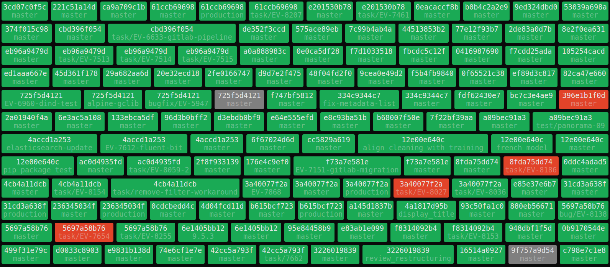
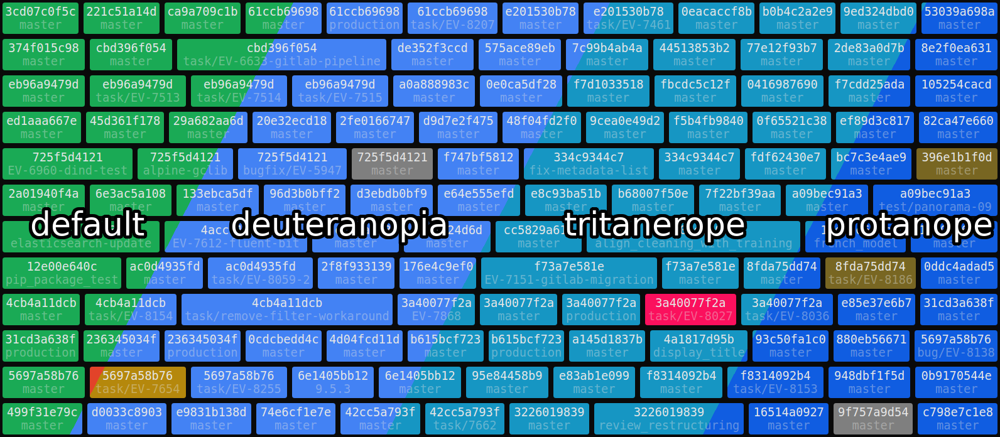
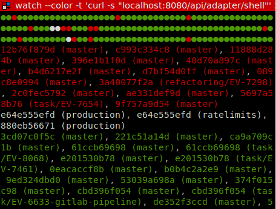
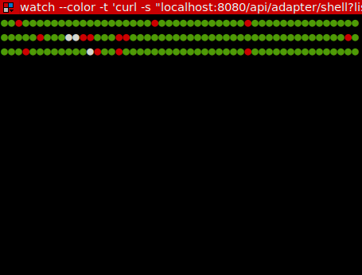

This project aims to visualize the latest pipeline for all branches in every repository in various output-formats. Output-formats currently available are: ccmenu, html, json, bash and prometheus (See adapter below for screenshots). The queried repositories and branches can be configuried using whitelist/blacklist and regular expressions.

This project is intended to be used as hub for your team, therefore you only have to configure a single token once. After setup GitLab panorama retrieves all future updates by using a webhook. The service queries the pipeline-states only once at the beginning. This is the biggest difference to other gitlab-pipeline-monitors out there and makes especially sense if you have a large amount of project (where you easily end up having thousands of requests to the gitlab api .. per client, requesting over and over again, running into throtteling). In contrast GitLab-panoramas response-times for the pipeline-states are lightning fast, because the current state is always up-to-date and comes from memory.

# Starting panorama

The project is available as docker image and can be easily started:
```
docker run --rm -it -p 8080:8080 -e "GITLAB_TOKEN=<your api token>" joblift/gitlab-panorama:latest
```

A healthcheck for liveness or readiness probes is available at `/ping`.

# Configuration

GitLab panorama will be configured by using environment-variables, Java system properties or yaml file.
The easiest (and recommended way) is to use environment-variables when panorama is started as Docker container.

It is required to setup a Webhook in your Gitlab instance in order to get pipeline updates.

## Gitlab Webhook

You have to define a webhook with the triggers `Push events` and `Pipeline Events`. Also it is recommended to use ssl (`Enable SSL verification`), and utilize the `Secret Token`.
There are two options where to setup the webhook:

* For each required project (Gitlab free/core) within `settings / integrations`. See a [screenshot](media/screenshot-gitlab-webhook.png).
* For a whole subgroup - aka [Group webhooks](https://docs.gitlab.com/ee/user/project/integrations/webhooks.html) (Gitlab bronze/starter).

## GitLab panorama - environment variables

| Variable                      | Required |  Default value            | Description |
| ----------------------------- | -------- | ------------------------- | ----------- |
| `GITLAB_TOKEN`                | YES      |                           | A gitlab [access token](https://gitlab.com/profile/personal_access_tokens). A token with scope API is required. |
| `GITLAB_ENDPOINT`             |          | https://gitlab.com/api/v4 | GitLab API endpoint. |
| `GITLAB_TIMEOUT`              |          | `20s`                     | Timeout for gitlab api requests. |
| `WEBHOOK_SECRET_TOKEN`        |          |                           | Increases security: https://docs.gitlab.com/ee/user/project/integrations/webhooks.html#secret-token |
| `INIT_COLLECT_FROM_GITLAB`    |          | true                      | Will query the pipelines once on service start. |
| `INIT_LOAD_FROM_STORAGE`      |          | false                     | Will load the pipelines from a local storage-file. This has some implications, read below. |
| `FILTER_PROJECTS_WHITELIST_n` |          | `.*`                      | A regular expression that is required to match the project name (pathNamespaced). Multiple expressions are possible, _n_ starts with 0. |
| `FILTER_PROJECTS_BLACKLIST_n` |          |                           | A regular expression that is required _NOT_ to match the project name (pathNamespaced). Multiple expressions are possible, _n_ starts with 0. |
| `FILTER_REFS_WHITELIST_n`     |          | `.*`                      | A regular expression that is required to match the ref name (pathNamespaced). Multiple expressions are possible, _n_ starts with 0. |
| `FILTER_REFS_BLACKLIST_n`     |          |                           | A regular expression that is required _NOT_ to match the ref name (pathNamespaced). Multiple expressions are possible, _n_ starts with 0. |
| `STORAGE_PATH`                |          | `~/.gitlab-panorama`      | Path to a directory, where the pipelines are stored. If empty, no pipelines will be stored. |


## Storage
GitLab panorama can store the state of the pipelines in a local file. This is useful if the service restarts, since at startup no pipelines are available and have to be queried from the GitLab API first. Depending on the amount of repositories, branches and pipelines this can take some minutes.
When using docker, you have to mount a volume to the specified path, otherwise data is lost between restarts.

Also it is very useful during development, avoiding massive queries to the GitLab API and faster startup phase.

However there are some **drawbacks**. If branches or projects with pipelines have been removed in the meantime, the pipelines loaded at startup and will never get removed. Webhooks are only triggered once, so there is no chance to catch those events if the service is not running. So this option shouldn't be used in a production environment.

# Adapter

## ccmenu
Endpoint: `/api/adapter/ccmenu`

Provides a resource for ccmenu clients in the specific xml-format to display the pipelines.

## html
Endpoint: `/api/adapter/html`

Shows a configurable list of pipeline as dynamic single-page-application website.

Supported parameter:

| Parameter      | Default          | Values                                                       | Description                                                  |
| -------------- | ---------------- | ------------------------------------------------------------ | ------------------------------------------------------------ |
| `filterStatus` | (empty)          | Comma-separated list of status, or empty (all). Available states: `success`, `failed`, `canceled`, `skipped` | Shows only pipelines not within the specified list.          |
| `onlyRefs`     | (empty)          | Comma-separated list of refs, or empty (all).                | Shows only pipelines from the refs within the specified list. |
| `sort`         | `alphabetically` | One of `alphabetically`, `importance`                        | Sort the list by one of the available options.               |
| `theme`        | `default`        | One of `default`, `deuteranopia`, `protanope`, `tritanerope`, `aprilfools` | Defines a color theme. Themes for color-blindness are provided, please [give feedback](https://github.com/joblift/gitlab-panorama/issues) when the colors can be optimized. |

Screenshot (with obfuscated project names):



Various themes:



## shell
Endpoint: `/api/adapter/shell`

Displays the state of the pipelines as shell-compatible screen. Best used with `watch` to update the screen:

```
watch --color -t 'curl -s "<host>/api/adapter/shell"'
```

Supported parameter:

| Parameter           | Default  |  Values | Description |
| ------------------- | -------- | ------- | ----------- |
| `dots`              | `true`   | boolean | Display symbols. |
| `refs`              | `true`   | boolean | Display the ref behind the repository name. |
| `lists`             | `true`   | boolean | Display the pipeline projects as list. |
| `filterStatus`      | (empty)  | Comma-separated list of status, or empty (all). Available states: `success`, `failed`, `canceled`, `skipped` | Shows only pipelines not within the specified list. |
| `delimiterLists`    | `\n`     | String  | Seperator behind each state-list. |
| `delimiterProjects` | `, `     | String  | Seperator behind each displayed project. |

Screenshots (with obfuscated project names):

 

## json
Endpoint: `/api/adapter/json`

Actually only used by the html endpoint.

## prometheus
Endpoint: `/api/adapter/prometheus`

Can be used as exporter from a prometheus scraper. Return values are: success=0, skipped=1, canceled=2, failed=10. 

Examples:

```
gitlab_pipeline_state{repository="hubble",ref="master",state="success"} 0
gitlab_pipeline_state{repository="hubble",ref="task/lens",state="failed"} 10
```

# Other projects
Projects that could be used in conjunction to GitLab panorama to visualize, notify or analyze the outputs from the service:

* [BuildNotify](https://anaynayak.github.io/buildnotify) - CCMenu/CCTray equivalent for Ubuntu
* [Nevergreen](https://nevergreen.io) - Alternative ccmenu build monitor
* [ccmenu](http://ccmenu.org/) - ccmenu for the Mac OS menu bar
* [Prometheus](https://prometheus.io/) - metric alerts and monitoring solution


### Disclamer
GitLab is a registered trademark of GitLab, Inc. The [GitLab logo](https://about.gitlab.com/handbook/marketing/corporate-marketing/#gitlab-trademark--logo-guidelines) is subject to the terms of the Creative Commons Attribution Non-Commercial ShareAlike 4.0 International License.

